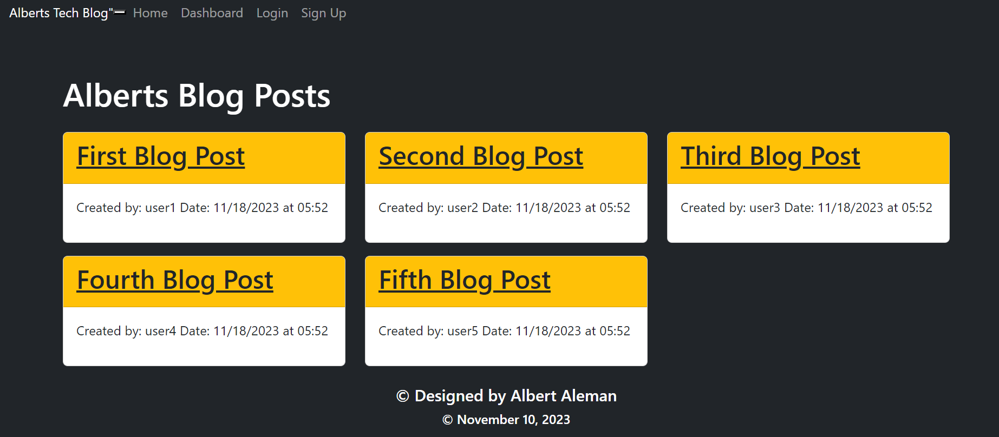
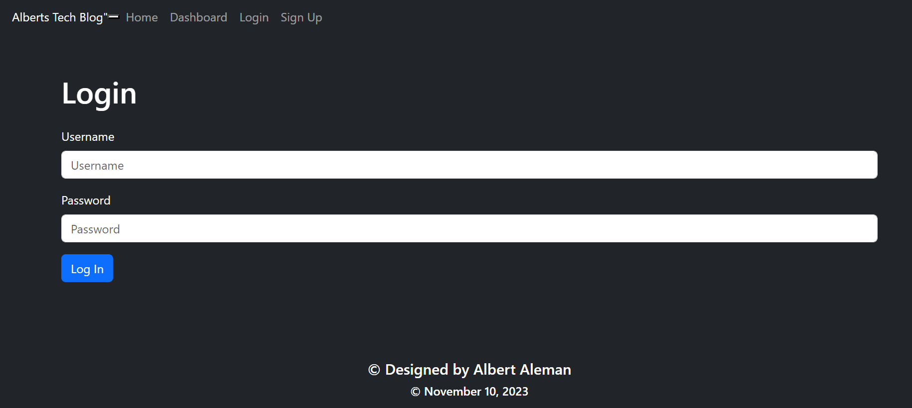

# Albert-s-MVC-Tech-Blog
 github repo: https://github.com/aalemanyz67/Albert-s-MVC-Tech-Blog 

 Heroku Deployment link: https://mymvc-tech-blog-81561e359a62.herokuapp.com/  

Looking to be part of a new Dev Community. Look no further! Alberts MVC Tech Blog is a perfect community to share and learn from other developers. Feel free to join so that you can read some tech blogs or so that you can upload your own.

# Objective 
My task was to create a CMS-Style blog site that would allow a user to sign up and create a blog. The user would be able to view other blog posts and comment on them. The user would be able to navigate through out the blog site with the ability to log out and login.

# Installation
An individual can visit my github "https://github.com/aalemanyz67/Albert-s-MVC-Tech-Blog" and clone it to thier terminal. Once it has been cloned they can click on the package.json file and open the intergrated terminal. Once inside the terminal they can install all required packages and dependencies by using the command "npm i". Once installation has finished they can then seed all their data by using clicking on server.js file and opening the intergrated terminal and typing the command "node seeds/index.js". Now that the data has been seeded the user can not click on the server.js file and open up the intergrated terminal. Once there the user can use the command "node server.js" to run the local server and use the browser to see the application in browser. The user can also click on the deployed link to also access the blog application. 

# Usage and Future Imporvements
This web application is greate for discourse and a creation of a tech community. Users all over can post a blog and comment on other blogs about the tech they are using, working on, debugging, and any thing tech dev. 

Unfortunately my blog application isnt 100 percent functional. I would like to complete my blog application by fixing the singup routes and dashboard routes. This would allow my blog application to function at a higher performance. 

# Screenshots and Errors
 blog application homepage 

 blog application loginpage 

 dashboard page error 

 signup error within server 

# Collaborators and Resources
Collaborators - Youtuber Thomas - helped me with routes and structure of folders/files according to MVC structure.
NPM Packages:
express-handlebars
seqauelize
bcrypt
dotenv 
espress-sessions
connect-sessions-sequelize
express
mysql2

deployed by Heroku - https://www.heroku.com/
mysql workbench - https://www.mysql.com/products/workbench/

# License: MIT
https://choosealicense.com/licenses/mit/
